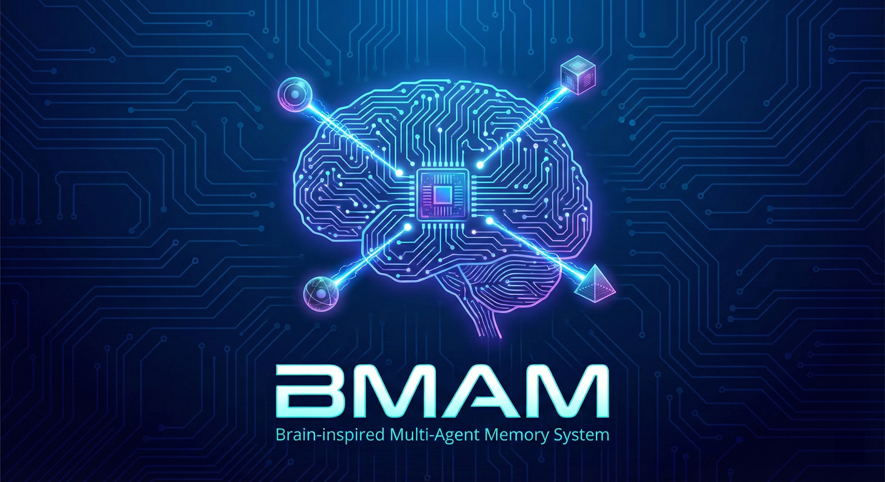

<p align="center">
  
</p>

# BMAM: Brain-inspired Multi-Agent Memory System

[](https://opensource.org/licenses/MIT)
[](https://www.python.org/downloads/)
[](https://arxiv.org/abs/2601.20465)

**English | [中文](README_CN.md)**

> **A pluggable soul substrate for AI agents — brain-inspired memory that IS the soul, not just stores it**

> [!NOTE]
> This project is a **preliminary exploration** of applying brain-inspired mechanisms to LLM memory systems. We are actively improving the framework — contributions, feedback, and discussions are welcome! Please open an issue if you have suggestions or find bugs.

Memory is not a tool the soul uses — **memory is the soul itself**. A person who loses their memories loses who they are. BMAM is a pluggable, LLM-agnostic memory system that gives any AI agent a persistent identity: experiences, emotional imprints, values, habits, and preferences that survive across sessions, across LLM engines, and across host systems.

BMAM addresses the **Soul Erosion** problem — the gradual degradation of an AI agent's identity and behavioral consistency due to memory failures — through 5 coordinated brain-region agents implementing the complete biological memory lifecycle: **encode → consolidate → retrieve → reflect → detect distortion → forget → reconsolidate**.

## Key Features

- **Brain-Region Specialization**: 5 specialized agents (Hippocampus, Temporal Lobe, Amygdala, Prefrontal Cortex, Basal Ganglia) with biologically-inspired coordination
- **Complete Memory Lifecycle**: 5 background loops — consolidation (full brain-region replay), reconsolidation, reflection, distortion detection, and forgetting (silent engrams, not deletion)
- **Hybrid Retrieval**: BM25 + Dense Vectors + Knowledge Graph + Entity Index — 4-signal "winner-take-all" fusion with collaborative boost
- **Soul Portability**: Export/import memory archives (.bma format) for identity transfer across systems
- **LLM-Agnostic**: Works with any LLM at GPT-4o-mini level or above — soul consistency guaranteed by structured storage, not prompt engineering
- **Pluggable Architecture**: REST API service — any agent system (ARIA, AURA, NEXUS, or third-party) can plug in BMAM as its memory
- **HRM Integration**: Hierarchical Recurrent Memory for multi-timescale organization (fast: Hippocampus τ=1, slow: Prefrontal τ=10)
- **Online Learning**: Q-learning (BasalGanglia), strategy feedback (PrefrontalFeedback), continuous learning loop, adaptive memory shaping

## Performance

| Benchmark | Scale | Accuracy | Note |
|-----------|-------|----------|------|
| **LoCoMo** | 10 groups, 1986 QA | **78.45%** | Long-context temporal reasoning |
| **LongMemEval** | 500 samples | **67.60%** | 6 question types |
| **PrefEval** | 1000 samples | **72.9%** | User preference understanding |
| **PersonaMem** | 20 users, 589 QA | 48.9% | User persona memory |

### LoCoMo Category Breakdown

| Category | Accuracy | Note |
|----------|----------|------|
| Single-hop | **82.00%** | SOTA |
| Multi-hop | **70.42%** | SOTA |
| Temporal | 62.31% | |
| Open-domain | **79.55%** | SOTA |

## Soul Erosion: Why Memory Matters

We introduce **Soul Erosion** as a framework for understanding AI memory failures:

| Erosion Type | Problem | BMAM Solution |
|--------------|---------|---------------|
| **Temporal** | Loses track of *when* events occurred | StoryArc timeline + relative date resolution |
| **Semantic** | Facts become inconsistent | Hippocampus→Temporal Lobe consolidation + KG |
| **Identity** | User preferences forgotten | Amygdala salience + ValueProfile + PersonaMemory |
| **Behavioral** | Habits and patterns lost | Basal Ganglia procedural memory + Q-learning |
| **Emotional** | Emotional context decays | Amygdala tagging during consolidation replay |
| **Distortion** | Memories corrupted over time | MemoryDistortionAgent detection + flagging |

**Key insight**: No single memory mechanism can prevent all erosion types. BMAM's multi-agent design provides complementary protections through the **complete biological memory lifecycle** — not just store-and-retrieve, but consolidate, reflect, detect distortion, and adaptively forget.

## Architecture

```
                         BrainInspiredCoordinator
    ┌──────────────────────────────────────────────────────────┐
    │                                                          │
    │   ┌─────────────┐  ┌─────────────┐  ┌─────────────┐     │
    │   │ Hippocampus │  │Temporal Lobe│  │   Amygdala  │     │
    │   │ (Episodic)  │  │(Semantic+KG)│  │ (Emotion)   │     │
    │   └──────┬──────┘  └──────┬──────┘  └──────┬──────┘     │
    │          │                │                │             │
    │   ┌──────┴────────────────┴────────────────┴──────┐     │
    │   │           Consolidation Replay                │     │
    │   │   (Sleep: Hippocampus → ALL brain regions)    │     │
    │   └───────────────────────────────────────────────┘     │
    │          │                │                │             │
    │   ┌──────┴──────┐  ┌─────┴───────┐  ┌────┴────────┐   │
    │   │ Prefrontal  │  │Basal Ganglia│  │  Thalamus   │   │
    │   │ (Working    │  │(Procedural  │  │  (Gating +  │   │
    │   │  Memory)    │  │ + Q-learn)  │  │   HRM)      │   │
    │   └─────────────┘  └─────────────┘  └─────────────┘   │
    │                                                          │
    │   Background Loops:                                      │
    │   Consolidate → Reconsolidate → Reflect → Distort → Forget
    └──────────────────────────────────────────────────────────┘
            │                                    │
      REST API (:8100)                    .bma export/import
      /v1/brain/*                         (Soul Transfer)
```

| Brain Region | Function | Anti-Erosion Role |
|--------------|----------|-------------------|
| **Hippocampus** | Episodic memory encoding | Temporal anchoring with StoryArc |
| **Temporal Lobe** | Semantic memory + KG | Fact stability via consolidation |
| **Amygdala** | Emotion tagging + consolidation replay | Identity & emotional imprint protection |
| **Prefrontal** | Working memory + routing | Context coherence + task coordination |
| **Basal Ganglia** | Procedural memory + Q-learning | Behavioral consistency + adaptive skill selection |
| **Thalamus** | HRM gating + region activation | Multi-timescale coordination |

## Installation

### Prerequisites

- Python 3.10+
- OpenAI API key (for embeddings and LLM judge)

### Setup

```bash
# Clone repository
git clone https://github.com/innovation64/BMAM.git
cd BMAM

# Create virtual environment
python3 -m venv .venv
source .venv/bin/activate  # Windows: .venv\Scripts\activate

# Install dependencies
pip install -r requirements.txt

# Configure environment
cp .env.example .env
# Edit .env:
# OPENAI_API_KEY=sk-xxx
# OPENAI_BASE_URL=https://api.openai.com/v1
```

### Dataset Preparation

Download datasets to `data/datasets/`:

```
data/datasets/
├── locomo/
│   └── locomo10.json           # LoCoMo (10 groups)
├── longmemeval/
│   └── longmemeval_oracle.json # LongMemEval (500 samples)
├── prefeval/
│   └── prefeval.json           # PrefEval (1000 samples)
└── personamem/
    └── personamem.json         # PersonaMem (20 users, 589 QA)
```

## Quick Start

```python
import asyncio
from datetime import datetime
from src.coordination.brain_coordinator_refactored import BrainInspiredCoordinator
from src.coordination.hrm_coordinator_wrapper import HRMCoordinatorWrapper, HRMConfig

async def main():
    # Initialize
    base_coord = BrainInspiredCoordinator()
    hrm_config = HRMConfig(enable_multi_timescale=True, enable_act=True)
    coord = HRMCoordinatorWrapper(base_coord, hrm_config)
    await coord.start_system()

    # Store memory
    await coord.store_memory_with_timestamp(
        "User mentioned they love hiking in the mountains",
        datetime.now(),
        "user",
        importance=0.8
    )

    # Query
    result = await coord.process_user_input("What are my hobbies?")
    print(result.response)

asyncio.run(main())
```

## Evaluation

### Memory Cleanup (Required before each benchmark)

```bash
rm -f data/memory/*.db data/memory/*.index data/memory/*.json
rm -f data/memory/checkpoints/*.json data/state/*.json
rm -rf data/cache/embedding data/cache/faiss_index data/cache/knowledge_graph
```

### Benchmark Tests

```bash
# LoCoMo (10 groups, ~10 hours)
python evaluation/benchmarks/locomo/test_sequential.py --groups 10

# LongMemEval (500 samples)
python evaluation/benchmarks/longmemeval/test_longmemeval.py --questions 0

# PrefEval (1000 samples)
python evaluation/benchmarks/prefeval/test_prefeval.py --questions 0

# PersonaMem (20 users)
python evaluation/benchmarks/personamem/test_personamem.py --users 20
```

### Ablation Experiments

BMAM supports two levels of ablation to validate multi-agent collaboration:

#### Brain-Region Ablation (Validates 5-region collaboration)

```bash
# Run all brain-region ablations
python evaluation/scripts/ablation/run_ablation.py --brain-regions --groups 3

# Available ablations:
# - no_hippocampus: Disable episodic encoding
# - no_temporal_lobe: Disable semantic memory + KG
# - no_amygdala: Disable salience tagging
# - no_prefrontal: Disable working memory control
# - no_basal_ganglia: Disable procedural patterns
```

#### Component Ablation (Validates functional modules)

```bash
# Run component ablations
python evaluation/scripts/ablation/run_ablation.py --components --groups 3

# Available ablations:
# - no_story_arc: Disable timeline indexing
# - no_temporal_reasoning: Disable time queries
# - no_kg: Disable knowledge graph
# - no_hybrid_retrieval: Vector-only retrieval
# - no_consolidation: Disable memory consolidation
```

#### List All Ablation Configs

```bash
python evaluation/scripts/ablation/run_ablation.py --list
```

### Soul Portability Test

Validates memory archive export/import and identity consistency:

```bash
# Run soul portability test
python evaluation/benchmarks/soul_portability/test_soul_portability.py

# With more questions
python evaluation/benchmarks/soul_portability/test_soul_portability.py --questions 50
```

**Test Phases:**
1. **Shaping**: Store memories and answer test questions
2. **Export**: Save memory archive (.bma format)
3. **Restore**: Clear memory and reload from archive
4. **Consistency**: Compare answers before/after restore

**Soul Integrity Score**: Weighted composite of export success, restore success, and answer consistency.

## Project Structure

```
BMAM/
├── src/
│   ├── api/                         # FastAPI REST API middleware
│   │   ├── app.py                   # Application factory
│   │   ├── routes/                  # memories, search, brain, archives, system, websocket
│   │   ├── models/                  # Pydantic request/response models
│   │   └── middleware_adapter.py    # Coordinator-to-API bridge
│   ├── ui/web_ui_server/frontend/   # React + Vite chat UI
│   ├── agents/
│   │   ├── brain_regions/           # 5 brain-region agents
│   │   │   ├── hippocampus_agent/   # Episodic memory
│   │   │   ├── temporal_lobe_agent/ # Semantic + KG
│   │   │   ├── prefrontal_agent/    # Working memory
│   │   │   ├── amygdala_agent.py    # Salience tagging
│   │   │   └── basal_ganglia_agent.py
│   │   └── core/                    # Functional agents
│   ├── memory/
│   │   ├── story_arc.py             # Timeline management
│   │   ├── memory_archive.py        # .bma format
│   │   └── memory_system/           # Storage backend
│   ├── coordination/
│   │   ├── brain_coordinator_refactored.py
│   │   ├── hrm_coordinator_wrapper.py
│   │   ├── learning_manager.py      # Continuous learning
│   │   ├── proactive_inquiry.py     # Active questioning
│   │   └── memory_archive_manager.py
│   ├── services/
│   │   ├── voice_service.py         # Voice orchestration
│   │   ├── voice_config.py          # STT/TTS/VAD config
│   │   ├── streaming_stt.py         # Real-time speech-to-text
│   │   └── tts_backends/            # Edge, OpenAI, CosyVoice
│   ├── config/
│   │   └── ablation_config.py       # Ablation configurations
│   └── reasoning/
│       └── memory_reasoning_chain.py
├── run_api.py                       # API entry point (port 8100)
├── Dockerfile                       # Container support
├── evaluation/
│   ├── benchmarks/
│   │   ├── locomo/
│   │   ├── longmemeval/
│   │   ├── prefeval/
│   │   ├── personamem/
│   │   └── soul_portability/
│   ├── scripts/
│   │   └── ablation/                # Ablation experiments
│   └── results/
├── data/
│   ├── datasets/                    # Benchmark datasets
│   ├── memory/                      # Runtime storage
│   └── state/                       # Agent states
└── archives/                        # Memory archives (.bma)
```

## Memory Archive Format (.bma)

BMAM supports exporting/importing memory as `.bma` archives:

```python
from src.coordination.memory_archive_manager import MemoryArchiveManager

# Export
archive_manager = MemoryArchiveManager(coordinator)
result = archive_manager.export_archive(
    archive_name="my_memory",
    output_dir=Path("archives/"),
    tags=["user_profile", "v1"]
)

# Import
result = archive_manager.load_archive(Path("archives/my_memory.bma"))
```

**Archive Contents:**
- SQLite database (episodic + semantic memories)
- FAISS vector index
- Brain-region state files (JSON)
- Knowledge graph
- StoryArc timeline
- Manifest with checksums

## What's New (v3.0 — March 2026)

### Added

- **FastAPI REST API Middleware** (`src/api/`, `run_api.py`)
  - Mem0-compatible REST endpoints (memories, search, brain, archives, system)
  - WebSocket support for real-time text & voice streaming
  - API key authentication (optional via `BMAM_API_KEY`)
  - CORS configurable, Docker-ready (port 8100)

- **React Chat UI** (`src/ui/web_ui_server/frontend/`)
  - OpenAI-style chat interface built with React 19 + Vite + Tailwind
  - Brain region visualization, memory explorer, conversation history
  - Voice page with real-time STT/TTS
  - Proxies to BMAM API at `localhost:8100`

- **Voice Service** (`src/services/voice_service.py`)
  - 3 TTS backends: Edge TTS (free), OpenAI TTS, CosyVoice
  - Whisper large-v3 STT with CUDA acceleration
  - Silero VAD (Voice Activity Detection)
  - Per-connection voice sessions

- **Learning Manager** (`src/coordination/learning_manager.py`)
  - Continuous learning loop with retrieval history tracking
  - Plasticity management and routing weight optimization

- **Proactive Inquiry** (`src/coordination/proactive_inquiry.py`)
  - Contradiction detection, knowledge gap identification
  - ACC-inspired conflict monitoring with confidence thresholds

- **Docker Support** (`Dockerfile`)
  - Python 3.11-slim, port 8100, health check ready

### Removed

- Legacy Voice Anime UI (Live2D, static HTML/CSS/JS, old WebSocket backend)

### Running the System

```bash
# 1. Start API backend
cd BMAM && .venv/bin/python run_api.py   # http://localhost:8100

# 2. Start React frontend
cd src/ui/web_ui_server/frontend && npm run dev  # http://localhost:5173
```

---

## Known Issues

| # | Issue | Severity | Detail |
|---|-------|----------|--------|
| 1 | **PersonaMem accuracy low** | High | 48.9% — multi-brain coordination runs after reasoning, missing temporal lobe + amygdala context |
| 2 | **Emotion congruency disabled** | High | `src/brain/emotion_modulator.py` — emotion-aware retrieval not functional |
| 3 | **Prefrontal routing empty** | High | `src/agents/brain_regions/prefrontal_agent/` — query routing logic is placeholder |
| 4 | **HRM coordination timing** | Medium | Multi-brain-region fusion happens post-reasoning instead of pre-reasoning |
| 5 | **Hardcoded model names/thresholds** | Medium | 100+ hardcoded values scattered across codebase (REPAIR_TRACKER FIX-014, FIX-015) |
| 6 | **KG unification incomplete** | Medium | Mixed usage of `LightweightKnowledgeGraph` vs `SimpleKnowledgeGraph` |

## TODO / Optimization Roadmap

### High Priority

- [ ] **Fix HRM coordination timing** — move multi-brain fusion before reasoning to improve PersonaMem/PrefEval
- [ ] **Enable emotion congruency** — wire emotion modulator into retrieval pipeline
- [ ] **Implement prefrontal routing** — replace placeholder with real query routing logic
- [ ] **Improve PersonaMem accuracy** — target ≥55% through better user preference extraction

### Medium Priority

- [ ] **Extract hardcoded values to config** — model names, thresholds, paths → centralized config
- [ ] **Unify Knowledge Graph** — standardize on single KG implementation
- [ ] **Complete Learning Manager** — implement `reflect()` and `suggest()` methods
- [ ] **Integrate Proactive Inquiry** — wire into conversation pipeline
- [ ] **Add API tests** — WebSocket protocol, auth enforcement, voice session lifecycle

### Low Priority

- [ ] **Implement Remote Brain Service** — `download_file()` / `upload_file()` stubs
- [ ] **Wikidata integration** — real search in `data_sources.py`
- [ ] **Frontend unit tests** — React component testing
- [ ] **Theory of Mind redesign** — improve intent understanding (noted in coordinator)
- [ ] **Ablation enforcement** — ensure ablation configs are properly enforced in code path

---

## Troubleshooting

### Common Issues

**1. OpenAI API Errors (502/Cloudflare)**
- Check API key and base URL in `.env`
- Wait and retry for temporary issues

**2. Memory Pollution**
- Clean memory before each benchmark
- Never run multiple benchmarks in parallel

**3. Out of Memory**
- Ensure 8GB+ RAM
- Reduce batch size with `--groups 1`

### Verify Installation

```bash
python3 -c "from src.coordination.brain_coordinator_refactored import BrainInspiredCoordinator; print('OK')"
```

## Citation

```bibtex
@article{li2026bmam,
  title={BMAM: Brain-inspired Multi-Agent Memory Framework for LLM-Based Agents},
  author={Li, Yang and Liu, Jiaxiang and Wang, Yusong and Wu, Yujie and Xu, Mingkun},
  journal={arXiv preprint arXiv:2601.20465},
  year={2026}
}
```

## License

MIT License - see [LICENSE](LICENSE) for details.

---

**Version**: 3.0
**Last Updated**: March 2026
