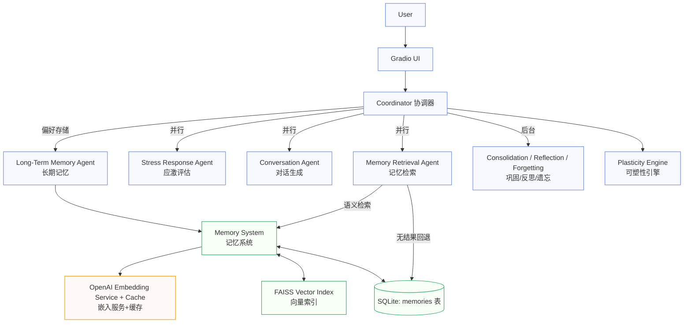
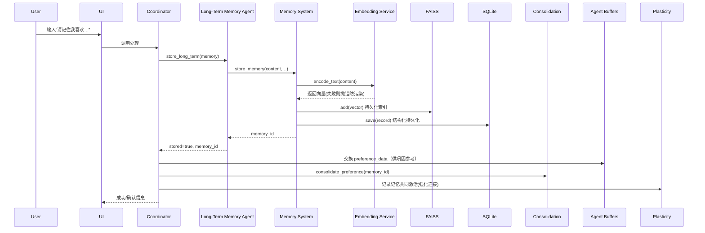
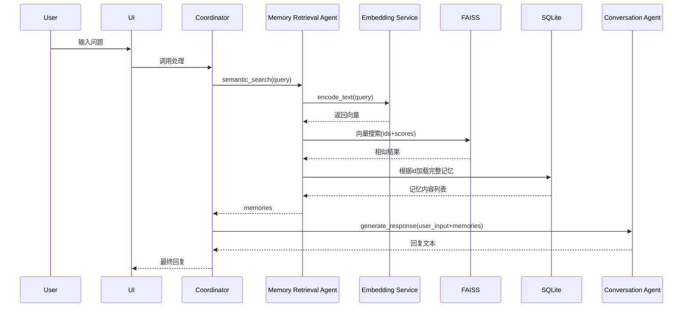

 现在我看到了！你确实是按照详细的脑区设计的，每个Agent对应一个特定脑区：

  🧠 你的完整12脑区Agent映射

  8个核心记忆处理Agent：

  1. short_term_memory → PREFRONTAL (前额叶)
    - 工作记忆、注意力控制
  2. long_term_memory → NEOCORTEX (新皮层)
    - 长期存储、语义记忆网络
  3. memory_retrieval → HIPPOCAMPUS (海马体)
    - 记忆检索、模式完成
  4. consolidation → HIPPOCAMPUS (海马体)
    - 记忆巩固、从短期到长期转移
  5. memory_distortion → THALAMUS (丘脑)
    - 记忆失真、感知重构
  6. reflection → DEFAULT_MODE (默认模式网络)
    - 反思、元认知、自我参照
  7. forgetting → INHIBITION (前额叶抑制网络)
    - 主动遗忘、干扰抑制
  8. stress_response → AMYGDALA (杏仁核)
    - 应激反应、情绪记忆调节

  4个辅助功能Agent：

  9. conversation → BROCA_WERNICKE (语言区)
  10. executive_control → ACC (前扣带皮层)
  11. perception_encoding → SENSORY_CORTEX (感觉皮层)
  12. action_execution → MOTOR_CORTEX (运动皮层)

  🎯 正确的可塑性记忆系统设计

  基于你的精确脑区映射，我建议的架构应该是：

  方案：脑区联合体系统 (Brain Circuit Systems)

  BrainCircuitSystems:
  ├── MemoryCircuit (记忆环路)
  │   ├── HIPPOCAMPUS_memory_retrieval
  │   ├── HIPPOCAMPUS_consolidation  
  │   ├── NEOCORTEX_long_term_memory
  │   └── PREFRONTAL_short_term_memory
  │
  ├── ExecutiveCircuit (执行环路)
  │   ├── PREFRONTAL_short_term_memory (共享)
  │   ├── ACC_executive_control
  │   └── INHIBITION_forgetting
  │
  ├── EmotionalCircuit (情绪环路)
  │   ├── AMYGDALA_stress_response
  │   ├── THALAMUS_memory_distortion
  │   └── DEFAULT_MODE_reflection
  │
  └── SensoryMotorCircuit (感知运动环路)
      ├── SENSORY_CORTEX_perception_encoding
      ├── MOTOR_CORTEX_action_execution
      └── BROCA_WERNICKE_conversation

  可塑性实现机制：

  1. 跨环路连接 - PREFRONTAL在多个环路间共享
  2. 动态权重调节 - 基于使用频率调整Agent间连接强度
  3. 环路竞争合作 - 不同环路间既竞争资源又协同工作
  4. 突触可塑性 - Agent间消息传递强度可动态调节

  扩展性设计：

  - 环路内扩展 - 在每个环路内增加同类型Agent实例
  - 新环路添加 - 添加专门的环路（如注意力环路、决策环路）
  - 跨物种扩展 - 添加其他动物的特殊脑区Agent

  这样的设计是否更符合你的可塑性记忆和脑区映射的设想？

  总体架构概览

核心思想: 以“类脑12智能体 + 可塑性引擎 + 记忆系统”组成的可适应对话与记忆框架
主要部件: 协调器、智能体群、记忆系统（SQLite + FAISS）、嵌入服务（OpenAI）、缓冲系统（JSON 文件）、可塑性引擎（连接强化）、UI
[User]
   │
   ▼
[Gradio UI]  ui.py
   │  调用
   ▼
[协调器 Coordinator]  src/coordination/brain_coordinator.py
   │      │并行触发
   │      ├────────────► [记忆检索Agent]  semantic+keyword检索
   │      ├────────────► [应激Agent]     情绪/威胁评估
   │      └────────────► [对话Agent]     基于检索记忆生成回复
   │
   │ 偏好判定时
   ├────────────► [长期记忆Agent]  存储“偏好”
   │                  │
   │                  ▼
   │        [记忆系统 MemorySystem]
   │         ├── SQLite 持久化 (memories 表)
   │         └── FAISS 向量库 (memory_vectors.index)
   │                  ▲
   │        [OpenAI 嵌入服务] text-embedding-3-small + 缓存
   │                  │
   │                  └── 失败即抛错，避免“脏向量”污染
   │
   └────────────► [巩固/反思/遗忘] 背景过程 + 可塑性引擎
关键存储

结构化数据库: SQLite（SQLAlchemy）
BMAM/src/memory/memory_system.py:304
记录内容、类型（语义/情节）、情绪标签、重要性、访问频率、关联等
向量数据库: FAISS 本地索引 + 映射文件
FAISS 类定义: BMAM/src/memory/memory_system.py:107
搜索入口: BMAM/src/memory/memory_system.py:148
索引持久化: BMAM/src/memory/memory_system.py:179
嵌入服务: OpenAI Embedding + 本地缓存
模型/维度/缓存: BMAM/src/services/openai_embedding_service.py:143
单条编码: BMAM/src/services/openai_embedding_service.py:155
失败策略（不落库以防污染）: BMAM/src/services/openai_embedding_service.py:230
主要组件

协调器 BrainInspiredCoordinator
路由与并行激活、处理统计、触发背景任务
文件: BMAM/src/coordination/brain_coordinator.py:48
智能体（部分举例）
记忆检索: 语义检索（优先 FAISS），无结果时关键字回退
文件: BMAM/src/agents/core/memory_retrieval.py:86
长期记忆: 统一调用 MemorySystem 存储并构建关联
文件: BMAM/src/agents/core/long_term_memory.py:89
巩固/反思/遗忘: 背景处理，提升长期稳定性与质量
记忆系统 AdvancedMemorySystem
组合 EmbeddingService + FAISSVectorDatabase + DatabaseManager
构造: BMAM/src/memory/memory_system.py:471
入库流程（含向量入索引）: BMAM/src/memory/memory_system.py:484
语义搜索入口: BMAM/src/memory/memory_system.py:550
可塑性引擎
记录“共同激活”的智能体与记忆，强化连接，用于下轮最优路由与联想
文件: BMAM/src/brain/synaptic_plasticity.py:20
缓冲系统（Agent Buffers）
以 JSON 文件隔离各 Agent 的最近输入/输出与交换数据
文件: BMAM/src/agents/agent_buffer_system.py:15
端到端流程图（记忆写入）

用户说“请记住我喜欢喝绿茶，每天下午3点左右。”
协调器识别“偏好”→ 激活长期记忆Agent存储
记忆系统生成嵌入（OpenAI）→ 写入 FAISS → 写入 SQLite
成功后可能触发“记忆巩固”（背景）与“缓冲交换”
可塑性引擎记录此次记忆与上下文激活，增强后续路由与联想
端到端流程图（检索回答）

用户问“我刚才说我什么时候喝什么茶？”
并行：记忆检索（向量相似）与应激检测
若语义检索为空，则关键字回退（“茶/绿茶/下午/3点”）
文件: BMAM/src/agents/core/memory_retrieval.py:108
对话Agent基于检索记忆生成自然回复
协调器根据“是否应存储整轮对话”决定是否写入一条“完整对话记忆”
为什么这样设计（面向小白的解释）

模块化像“人脑分工”: 不同 Agent 像不同脑区，各司其职（记忆检索、表达语言、情绪评估、长期存储）。更容易定位问题与扩展新能力。
两级存储（SQLite + FAISS）: 数据库保存“内容与属性”，FAISS保存“语义向量”以实现“理解相似意思”的搜索。两者互补。
嵌入失败保护: 当网络或额度问题导致嵌入失败时，宁可不落库也不把“错误向量”写进索引；否则以后的检索会被错误数据“污染”。
见: BMAM/src/services/openai_embedding_service.py:230
缓冲系统（JSON 文件）: 让智能体彼此之间可以传“摘要信息”，但不强耦合在一处；出问题只清某个缓冲文件即可，健壮可观测。
可塑性学习: 系统会“记得”哪些路径经常有效，下次更倾向走这条“捷径”，像人脑“越用越熟”的学习过程。
易于部署: 默认 SQLite + 本地 FAISS，无需搭数据库集群；后续想切换到 Postgres/Milvus 也很方便（改连接串/适配器）。
可视化：系统层级图

+-----------------------------------------------------------+
|                          UI (Gradio)                      |
+-------------------------------+---------------------------+
                                |
                                v
+--------------------------- Coordinator --------------------+
| 路由/并行/统计/背景任务/可塑性触发                          |
+------+---------------------+----------------------+--------+
       |并行触发             |偏好存储             |背景流程
       v                     v                      v
  [Memory Retrieval]   [Long-Term Memory]   [Consolidation/Reflection/Forgetting]
       |                     |                         |
       | 语义检索            | 入库                    | 结构优化/巩固/遗忘
       v                     v                         v
+------------------ Memory System ---------------------------+
|  SQLite (memories)   <-->  FAISS (vectors + mappings)     |
+-------------------+--------------------+-------------------+
                    |
                    v
       [OpenAI Embedding Service + Cache]
关键文件定位

BMAM/src/coordination/brain_coordinator.py:48 协调器主体
BMAM/src/agents/core/memory_retrieval.py:86 语义检索与回退
BMAM/src/agents/core/long_term_memory.py:89 统一存储入口
BMAM/src/memory/memory_system.py:471 记忆系统组合
BMAM/src/memory/memory_system.py:484 入库含向量写入
BMAM/src/memory/memory_system.py:148 向量搜索
BMAM/src/services/openai_embedding_service.py:155 文本编码
BMAM/src/brain/synaptic_plasticity.py:20 可塑性连接网络
BMAM/src/agents/agent_buffer_system.py:15 缓冲系统定义
BMAM/src/memory/memory_system.py:304 数据库连接串（默认 SQLite）
当前取舍与局限

目标准确性与健壮性：嵌入失败不入库，短期看会“没记住”，长期看可避免索引污染，检索更可靠。
未接入外部图数据库：关联以 JSON/内存网络维护，简单易用；如需复杂图查询可后续接入 Neo4j 等。
语义检索中文阈值放宽：提升召回，必要时可结合 rerank 或 MMR（项目已有优化器雏形 BMAM/src/memory/memory_optimizer.py:77）。
如果你希望，我可以：

用你的真实场景绘一版“你的系统时序图”（从点击发送到返回），或
生成一份 Mermaid/PlantUML 代码，便于你在文档/看板中渲染成图。

