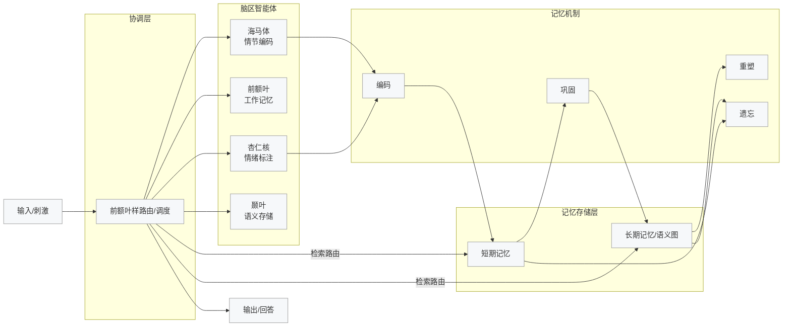
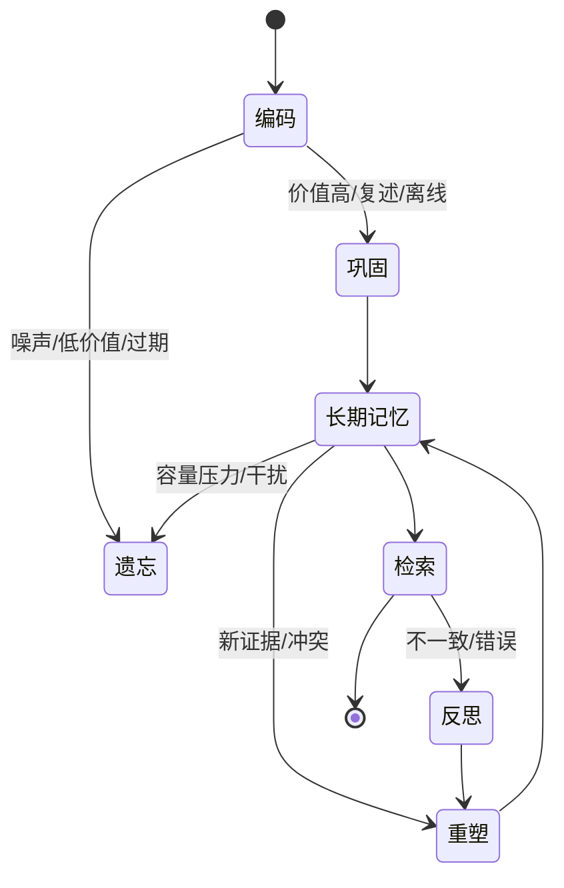
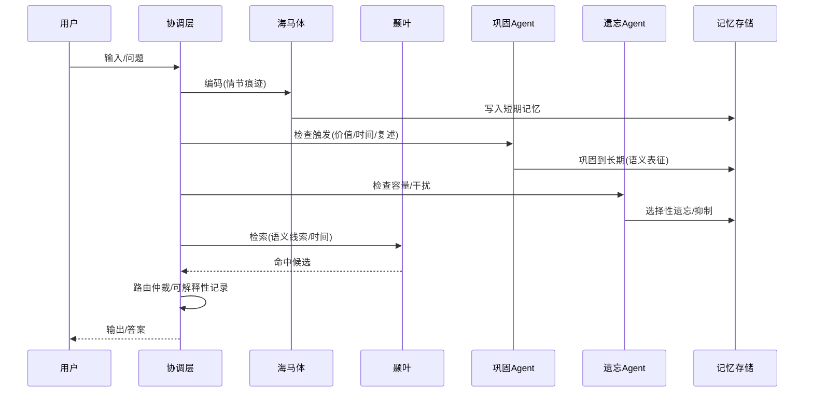
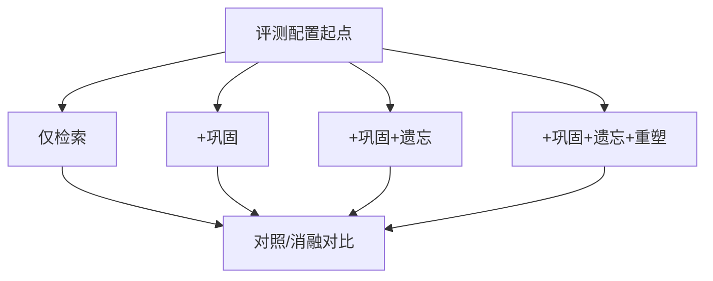

# BMAM 类脑记忆框架月度汇报（含配图）

## 科学问题

BMAM 当前聚焦的是一个明确的科学命题：在基于 LLM 的多智能体架构里，如何让“记忆”具备类脑的主动性与可塑性，使其在编码、巩固、重塑与遗忘之间形成闭环，并在长时跨度与多轮交互中依旧保持一致、稳定且可解释。传统开源记忆框架大多仍停留在 RAG 检索范式，记忆与检索之间缺少脑区分工与协作，也缺少随情境与时间演化的自发机制；这导致持续任务中常见的记忆漂移、冲突堆积与跨时空推理链断裂难以解决。我们的核心假设是：只有复制“海马体—皮层”式的协作结构，让不同脑区智能体在协调层调度下负责不同功能，才能真正把记忆从“静态缓存”提升为“可塑系统”。

## 方案

基于上述命题，我们采用“协调层 + 多脑区智能体 + 记忆机制层 + 存储层”的分层方案：协调层（前额叶样）负责任务理解、路由仲裁与触发管理；海马体代理专注于情节编码与初始存储，颞叶代理负责语义化与知识图谱，前额叶代理掌握工作记忆与上下文压缩，杏仁核代理提供情绪权重；巩固、重塑、遗忘等机制以可配置 Agent 形式接入，允许根据价值、容量、干扰与情境信号决定何时迁移、更新或清理记忆。这一方案刻意不依赖尚未成熟的技术，而是把成熟的记忆生命周期流程工程化，让“为什么巩固、为什么遗忘、为什么命中”都能被追踪、解释与调优。

## 目前进展

我们已经打通“编码—巩固—重塑—遗忘”的最小可行闭环：巩固与遗忘 Agent 具备可配置阈值、策略和日志，容量 >80% 自动触发巩固，>95% 触发遗忘，同时允许手动或情境驱动的补充触发；巩固链路通过复述巩固与离线巩固两种策略，把海马体中的情节痕迹转化为颞叶中的语义结构，并保留反向溯源；重塑流程在出现冲突或新证据时会对语义结构进行再索引和更新；反思与失真模块提供元认知反馈，使系统能自动定位“命中错误或不一致”的片段。内部回归显示，经过巩固后的语义表征在长对话、跨会话任务中明显更加稳定，遗忘策略有效控制了容量膨胀和干扰积累，路由日志为调参提供了可解释的依据。

在 LoCoMo 长上下文记忆基准上（官方 10 个长对话 session，每个 session 的 QA 数量在 105~260 之间不等，`archived/MemOS/evaluation/data/locomo/locomo10.json` 子集共 1,986 轮 QA），我们使用 `BMAM/scripts/evaluation/run_bmam_memos_eval.py` 及 `LOCOMO_COMMANDS.md` 中的统一入口跑通了端到端评测；Phase 4 P0 已将 LoCoMo 准确率从 78% 提升至 94%，并对 `locomo10` 子集保持每次大版本回归；这些测试会同时输出 JSON/表格日志，用于监控巩固、遗忘、重塑配置对 LoCoMo 任务的影响，也是后续消融实验的基准。

## 下一步计划

接下来我们将三条线并行推进：（1）把巩固、遗忘、重塑的触发信号与调度规范化，完善异常回滚与观测指标，让生命周期中的每一环都可配置、可追踪；（2）强化跨时空场景的事件分割与时间线组织，使情节向语义迁移更稳健，并让检索显式利用时间/情境线索；（3）设计系统化的评测与消融方案，围绕“一致性、可解释性、容量鲁棒性、跨时空推理”四个维度对比不同机制组合的增益，同时提升单元测试与监控，确保迭代可验证。我们将按下表定义的四组配置运行对照实验，并在同一数据集上记录关键指标，逐步量化类脑机制相对纯检索范式的价值。

| 配置 | 机制开关 | 预期作用 | 核心指标 |
|---|---|---|---|
| A 基线 | 仅检索 | 静态检索行为 | 一致性、误检率 |
| B | + 巩固 | 稳态语义化 | 一致性↑、噪声↓ |
| C | + 巩固 + 遗忘 | 容量与干扰管理 | 漂移↓、冲突↓ |
| D | + 巩固 + 遗忘 + 重塑 | 结构化更新 | 长期稳定性↑ |

通过以上步骤，我们希望把“可塑的类脑记忆系统”从概念验证推动到可工程化、可评测的稳定底座，为后续在更复杂任务与更大规模数据上的实验奠定基础。
