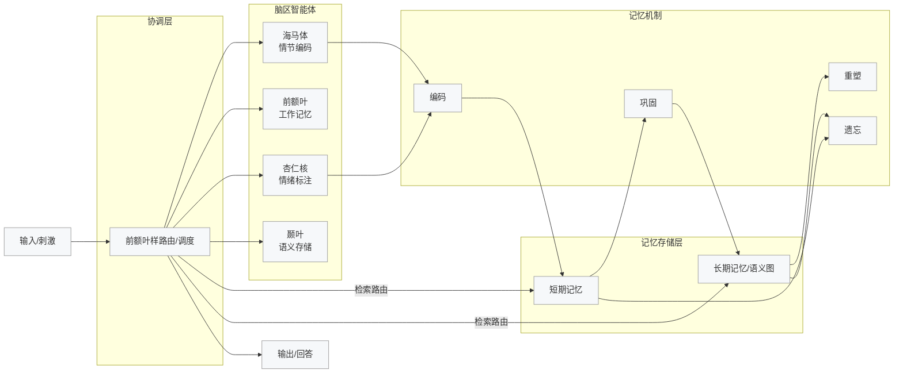
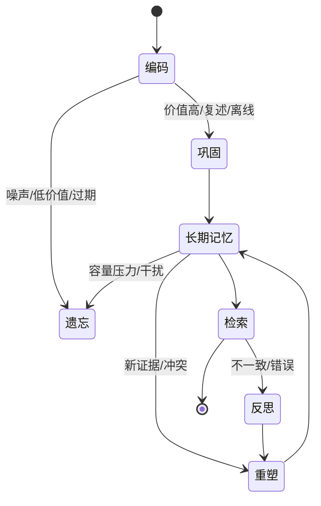
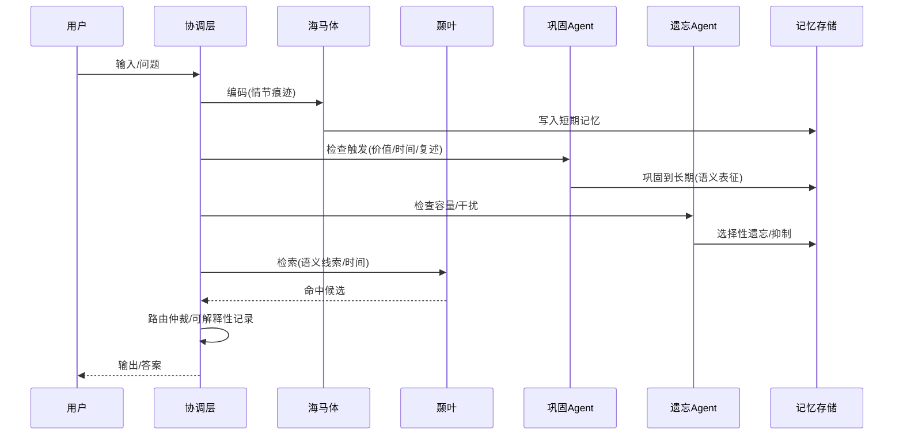
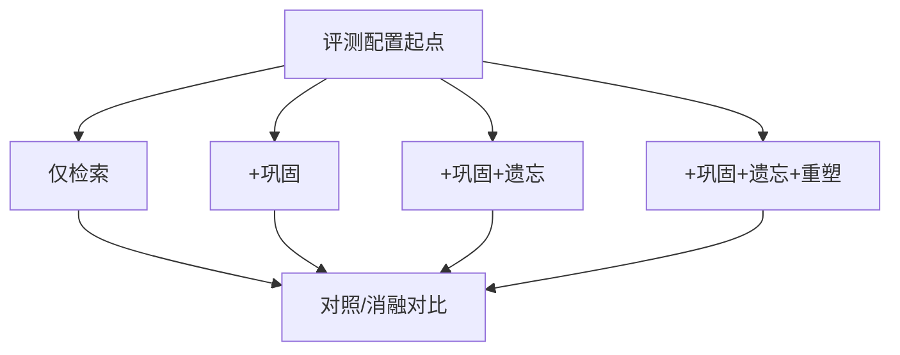

# BMAM 汇报配图（Mermaid 源码，可直接复制）

说明：以下四张图覆盖“方案/原理/执行/评测”四个角度，适合插入汇报PPT或支持 Mermaid 的Markdown文档。若目标工具不支持Mermaid，可将代码粘贴到 mermaid.live 生成SVG/PNG。

---

## 图1 类脑多智能体总览（协调层—脑区—机制—记忆层）

要点：强调“协调层编排 → 脑区分工 → 机制作用 → 存储层落地”的数据/控制流，凸显类脑而非静态检索范式。

---

## 图2 记忆生命周期闭环（编码→巩固→重塑→遗忘→再检索）

要点：把“主动性与可塑性”可视化，说明进入/退出条件与反馈环（反思→重塑）。

---

## 图3 触发与调度时序（容量/干扰/情境→巩固/遗忘/重塑）

要点：体现“谁触发、何时触发、作用到哪里”，方便把调度逻辑与观测点对齐。

---

## 图4 评测与消融设计（一致性/可解释性/容量鲁棒/跨时空）

消融维度：巩固（CO）、遗忘（FO）、重塑（RE）、反思（RF）。建议四组配置做对照：

| 配置 | 机制开关 | 预期作用 | 关注指标 |
|---|---|---|---|
| A 基线 | 仅检索 | 静态检索行为 | 一致性、误检率 |
| B | + CO | 稳态语义化 | 一致性↑、噪声↓ |
| C | + CO + FO | 容量与干扰管理 | 漂移↓、冲突↓ |
| D | + CO + FO + RE | 结构化更新 | 长期稳定性↑ |

提示：通过配置文件/环境变量控制Agent参与与阈值（如容量阈值、干扰权重、重塑触发条件），在相同数据集下跑四组配置，记录“一致性、可解释性事件、容量命中率、跨时空任务成功率”等指标，形成方法学对比。

